# Chronos Architecture Overview

**Version:** 1.0  
**Last Updated:** January 2026

Chronos is a distributed cron system that provides reliable job scheduling without operational complexity. This document provides a comprehensive architectural overview of the system.

---

## Table of Contents

1. [System Overview](#system-overview)
2. [High-Level Architecture](#high-level-architecture)
3. [Core Components](#core-components)
4. [Data Flow](#data-flow)
5. [Deployment Topology](#deployment-topology)
6. [Package Structure](#package-structure)
7. [Design Decisions](#design-decisions)
8. [Appendix: API Quick Reference](#appendix-api-quick-reference)
9. [Security Architecture](#security-architecture)
10. [Cross-Region Federation](#cross-region-federation)
11. [Next-Gen Features](#next-gen-features)
    - [AI-Powered Schedule Optimization](#ai-powered-schedule-optimization-internalsmartched)
    - [Time-Travel Debugging](#time-travel-debugging-internalreplay)
    - [Job Marketplace](#job-marketplace-internalmarketplace)

---

## System Overview

Chronos is built on several key architectural principles:

| Principle | Implementation |
|-----------|----------------|
| **Zero Dependencies** | Single binary with embedded BadgerDB storage |
| **Distributed Consensus** | HashiCorp Raft for leader election and state replication |
| **At-Least-Once Execution** | Jobs run even during node failures |
| **Language Agnostic** | HTTP webhook dispatch (+ gRPC, Kafka, NATS, RabbitMQ) |
| **Observable** | Prometheus metrics, structured logging, Web UI |

---

## High-Level Architecture

```mermaid
graph TB
    subgraph "Clients"
        UI["🖥️ Web UI<br/>(React + TypeScript)"]
        CLI["⌨️ chronosctl CLI"]
        SDK["📦 REST API Clients"]
    end

    subgraph "Chronos Cluster"
        subgraph "Node 1 (Leader)"
            API1["HTTP API :8080"]
            SCHED1["Scheduler<br/>(Active)"]
            RAFT1["Raft"]
            DB1[("BadgerDB")]
        end
        
        subgraph "Node 2 (Follower)"
            API2["HTTP API :8080"]
            SCHED2["Scheduler<br/>(Standby)"]
            RAFT2["Raft"]
            DB2[("BadgerDB")]
        end
        
        subgraph "Node 3 (Follower)"
            API3["HTTP API :8080"]
            SCHED3["Scheduler<br/>(Standby)"]
            RAFT3["Raft"]
            DB3[("BadgerDB")]
        end
    end

    subgraph "Dispatch Targets"
        HTTP["🌐 HTTP Services"]
        GRPC["📡 gRPC Services"]
        MQ["📨 Message Queues<br/>(Kafka, NATS, RabbitMQ)"]
    end

    UI --> API1 & API2 & API3
    CLI --> API1 & API2 & API3
    SDK --> API1 & API2 & API3

    RAFT1 <-->|"Consensus"| RAFT2
    RAFT1 <-->|"Consensus"| RAFT3
    RAFT2 <-->|"Consensus"| RAFT3

    SCHED1 --> HTTP
    SCHED1 --> GRPC
    SCHED1 --> MQ

    API1 --> SCHED1
    SCHED1 --> RAFT1
    RAFT1 --> DB1
    RAFT2 --> DB2
    RAFT3 --> DB3
```



### Key Characteristics

- **Leader-based scheduling**: Only the Raft leader runs the scheduler; followers are on standby
- **Read scalability**: Any node can serve read requests
- **Write consistency**: All writes go through Raft consensus
- **Automatic failover**: Leader failure triggers election within ~5 seconds

---

## Core Components

### 1. Scheduler (`internal/scheduler`)

The scheduler is the heart of Chronos, responsible for triggering jobs at their scheduled times.

```mermaid
flowchart LR
    subgraph Scheduler
        TICK["⏱️ Ticker<br/>(1s interval)"]
        CACHE["📋 Schedule Cache<br/>(parsed cron expressions)"]
        PQ["🔢 Priority Queue<br/>(next run times)"]
        EXEC["▶️ Executor"]
    end

    TICK --> PQ
    PQ --> EXEC
    CACHE --> PQ
    EXEC --> DISP["Dispatcher"]
```



**Key Features:**
- **Priority queue** for efficient next-run calculation using a min-heap
- **Schedule cache** to avoid re-parsing cron expressions
- **Missed run policies**: `ignore`, `execute_one`, `execute_all`
- **Concurrency control**: `allow`, `forbid`, `replace` policies

**Configuration:**
```yaml
scheduler:
  tick_interval: 1s          # How often to check for due jobs
  execution_timeout: 5m      # Default job timeout
  missed_run_policy: execute_one
```

---

### 2. Raft Consensus (`internal/raft`)

Chronos uses [HashiCorp Raft](https://github.com/hashicorp/raft) for distributed consensus.


**Raft FSM Commands:**
| Command | Description |
|---------|-------------|
| `CreateJob` | Add a new job |
| `UpdateJob` | Modify job configuration |
| `DeleteJob` | Remove a job |
| `RecordExecution` | Store execution results |
| `UpdateSchedule` | Update next run time |

**Configuration:**
```yaml
cluster:
  node_id: chronos-1
  raft:
    address: 10.0.0.1:7000
    peers:
      - chronos-2:7000
      - chronos-3:7000
    heartbeat_timeout: 500ms
    election_timeout: 1s
    snapshot_interval: 30s
    snapshot_threshold: 1000
```

---

### 3. Storage Layer (`internal/storage`)

BadgerDB provides embedded key-value storage with ACID transactions.


**Key Prefixes:**
| Prefix | Data Type |
|--------|-----------|
| `jobs/` | Job definitions |
| `executions/` | Execution history |
| `schedule/` | Next run times |
| `locks/` | Distributed locks |
| `versions/` | Schema versions |

---

### 4. Dispatcher (`internal/dispatcher`)

The multi-protocol dispatcher handles job execution across different transport mechanisms.


**Circuit Breaker States:**


---

### 5. API Layer (`internal/api`)

RESTful HTTP API with middleware stack.


**Middleware Chain:**
1. **Rate Limiter** - Token bucket per client
2. **Authentication** - API key / JWT validation
3. **RBAC** - Role-based access control
4. **Policy** - Policy-as-code enforcement
5. **Audit** - Request/response logging

---

## Data Flow

### Job Execution Lifecycle


### Job Creation Flow


---

## Deployment Topology

### Single-Region HA Cluster

```mermaid
graph TB
    subgraph "Load Balancer"
        LB["🔄 L4/L7 Load Balancer"]
    end

    subgraph "Availability Zone A"
        N1["Chronos Node 1<br/>Leader"]
    end

    subgraph "Availability Zone B"
        N2["Chronos Node 2<br/>Follower"]
    end

    subgraph "Availability Zone C"
        N3["Chronos Node 3<br/>Follower"]
    end

    LB --> N1 & N2 & N3
    N1 <--> N2
    N1 <--> N3
    N2 <--> N3
```



**Recommended Production Setup:**
- 3 or 5 nodes across availability zones
- Odd number for Raft quorum
- Persistent storage (SSD recommended)

### Multi-Region Federation


---

## Package Structure

```
chronos/
├── cmd/
│   ├── chronos/              # Main server binary
│   │   └── main.go
│   └── chronosctl/           # CLI tool
│       └── main.go
│
├── internal/                 # Private application code
│   ├── api/                  # HTTP handlers & middleware
│   │   ├── handlers.go       # REST API handlers
│   │   ├── middleware.go     # Auth, RBAC, rate limiting
│   │   └── router.go         # Route definitions
│   │
│   ├── analytics/            # Execution analytics and reporting
│   │
│   ├── assistant/            # AI-powered job creation via LLM
│   │
│   ├── autoscale/            # Predictive cluster autoscaling
│   │
│   ├── chaos/                # Chaos engineering testing framework
│   │
│   ├── cloudevents/          # CloudEvents protocol support
│   │
│   ├── compliance/           # Compliance and audit framework
│   │
│   ├── config/               # Configuration management
│   │
│   ├── cost/                 # Multi-cloud cost optimization
│   │
│   ├── dag/                  # Workflow engine
│   │   ├── dag.go            # DAG execution
│   │   └── builder.go        # Visual workflow builder
│   │
│   ├── dispatcher/           # Job execution
│   │   ├── dispatcher.go     # HTTP webhook dispatcher
│   │   ├── multi.go          # Multi-protocol router
│   │   ├── grpc.go           # gRPC dispatcher
│   │   ├── kafka.go          # Kafka dispatcher
│   │   ├── nats.go           # NATS dispatcher
│   │   ├── rabbitmq.go       # RabbitMQ dispatcher
│   │   └── circuit_breaker.go
│   │
│   ├── eventmesh/            # Event mesh integration
│   │
│   ├── events/               # Event-driven job triggers
│   │
│   ├── geo/                  # Cross-region federation
│   │
│   ├── gitops/               # Git-based job synchronization
│   │
│   ├── marketplace/          # Job template marketplace
│   │
│   ├── metrics/              # Prometheus metrics collection
│   │
│   ├── mobile/               # Mobile app push notifications
│   │
│   ├── models/               # Domain models
│   │   ├── job.go            # Job definition
│   │   └── execution.go      # Execution record
│   │
│   ├── notify/               # Notification system
│   │
│   ├── policy/               # Policy-as-code engine
│   │
│   ├── prediction/           # ML-based failure prediction
│   │
│   ├── raft/                 # Distributed consensus
│   │   ├── node.go           # Raft node management
│   │   ├── fsm.go            # Finite state machine
│   │   └── commands.go       # Raft command types
│   │
│   ├── rbac/                 # Role-based access control
│   │
│   ├── realtime/             # WebSocket collaboration
│   │
│   ├── replay/               # Time-travel debugging
│   │
│   ├── sandbox/              # Isolated container execution
│   │
│   ├── scheduler/            # Core scheduling engine
│   │   ├── scheduler.go      # Main scheduler loop
│   │   └── queue.go          # Priority queue for next runs
│   │
│   ├── search/               # Semantic job search
│   │
│   ├── secrets/              # Secret injection (Vault, cloud)
│   │
│   ├── smartsched/           # AI schedule optimization
│   │
│   ├── storage/              # Persistence layer
│   │   ├── badger.go         # BadgerDB implementation
│   │   └── interfaces.go     # Storage interfaces
│   │
│   ├── studio/               # Webhook testing and debugging
│   │
│   ├── tenant/               # Multi-tenant SaaS support
│   │
│   ├── tracing/              # OpenTelemetry integration
│   │
│   └── wasm/                 # WebAssembly plugin runtime
│
├── pkg/                      # Public libraries
│   ├── clock/                # Time utilities
│   ├── cloud/                # Cloud control plane
│   ├── cron/                 # Cron expression parser
│   ├── duration/             # Duration parsing
│   ├── executor/             # Cloud function executors
│   ├── grpc/                 # gRPC service definitions
│   └── plugin/               # Plugin interfaces
│
├── web/                      # React frontend
│   └── src/
│
├── api/
│   └── openapi.yaml          # OpenAPI 3.0 specification
│
├── deployments/              # Deployment configurations
│   ├── kubernetes/
│   └── docker/
│
└── docs/                     # Documentation
```

---

## Design Decisions

### Why Raft over Etcd/Consul?

| Factor | Embedded Raft | External Etcd/Consul |
|--------|---------------|----------------------|
| Dependencies | None | Requires separate cluster |
| Operational complexity | Low | High |
| Latency | ~1ms | ~10ms |
| Deployment | Single binary | Multiple components |

**Decision:** Embedded HashiCorp Raft minimizes operational burden while providing strong consistency guarantees.

### Why BadgerDB over SQLite/PostgreSQL?

| Factor | BadgerDB | SQLite | PostgreSQL |
|--------|----------|--------|------------|
| Embedded | ✅ | ✅ | ❌ |
| Write performance | Excellent | Good | Excellent |
| LSM-tree optimized | ✅ | ❌ | ❌ |
| Go-native | ✅ | CGO required | ❌ |

**Decision:** BadgerDB provides excellent write performance for append-heavy workloads (execution logs) without CGO dependencies.

### Why HTTP Webhooks as Primary Dispatch?

1. **Language agnostic** - Works with any HTTP server
2. **Debuggable** - Standard tooling (curl, Postman)
3. **Retry-friendly** - HTTP status codes indicate retry behavior
4. **Secure** - TLS, authentication headers built-in

Additional protocols (gRPC, Kafka, NATS, RabbitMQ) are supported for specialized use cases.

---

## Appendix: API Quick Reference

| Method | Endpoint | Description |
|--------|----------|-------------|
| `GET` | `/health` | Health check |
| `GET` | `/api/v1/jobs` | List jobs |
| `POST` | `/api/v1/jobs` | Create job |
| `GET` | `/api/v1/jobs/{id}` | Get job |
| `PUT` | `/api/v1/jobs/{id}` | Update job |
| `DELETE` | `/api/v1/jobs/{id}` | Delete job |
| `POST` | `/api/v1/jobs/{id}/trigger` | Manual trigger |
| `POST` | `/api/v1/jobs/{id}/enable` | Enable job |
| `POST` | `/api/v1/jobs/{id}/disable` | Disable job |
| `GET` | `/api/v1/jobs/{id}/executions` | Execution history |
| `GET` | `/api/v1/cluster/status` | Cluster status |
| `GET` | `/metrics` | Prometheus metrics |

For complete API documentation, see [api.md](api.md) or the [OpenAPI specification](../api/openapi.yaml).

---

---

## Security Architecture

Chronos implements defense-in-depth security with multiple layers of protection.

### Security Layers

```mermaid
flowchart TB
    subgraph "Perimeter"
        TLS["🔒 TLS 1.2+"]
        RATE["⏱️ Rate Limiting"]
    end

    subgraph "Authentication"
        APIKEY["🔑 API Keys"]
        JWT["🎫 JWT Tokens"]
        OAUTH["🔐 OAuth2/OIDC"]
    end

    subgraph "Authorization"
        RBAC["👤 RBAC"]
        POLICY["📜 Policy Engine"]
        NAMESPACE["📁 Namespace Isolation"]
    end

    subgraph "Audit"
        AUDIT["📝 Audit Logger"]
        TRACE["🔍 Distributed Tracing"]
    end

    TLS --> RATE
    RATE --> APIKEY & JWT & OAUTH
    APIKEY & JWT & OAUTH --> RBAC
    RBAC --> POLICY
    POLICY --> NAMESPACE
    NAMESPACE --> AUDIT
    AUDIT --> TRACE
```



### RBAC Model (`internal/rbac`)

Role-based access control with hierarchical permissions:

**Built-in Roles:**
| Role | Description | Key Permissions |
|------|-------------|-----------------|
| `admin` | Full cluster access | All permissions including `admin:*` |
| `operator` | Manage jobs and workflows | `job:*`, `workflow:*`, `execution:*` |
| `developer` | Create and manage own jobs | `job:create/read/update/trigger` |
| `viewer` | Read-only access | `job:read`, `execution:read` |

**Permission Categories:**
```
job:create/read/update/delete/trigger/enable/disable
execution:read/cancel/replay
workflow:create/read/update/delete
namespace:create/read/update/delete
team:create/read/update/delete/invite
admin:cluster/users/roles/audit/billing
policy:create/read/update/delete
```

**Multi-tenancy:**
- **Users** → assigned global roles + team roles
- **Teams** → groups of users with shared namespace access
- **Namespaces** → resource isolation with quotas

### Policy-as-Code Engine (`internal/policy`)

Declarative policy rules evaluated before job operations:

```mermaid
flowchart LR
    REQ["Job Create/Update"] --> EVAL["Policy Engine"]
    EVAL --> COMPILE["Compile Rules"]
    COMPILE --> CHECK{"Evaluate<br/>Conditions"}
    CHECK -->|Pass| ALLOW["✓ Allow"]
    CHECK -->|Fail| DENY["✗ Deny + Violations"]
```



**Example Policy:**
```yaml
id: production-security
name: Production Security Rules
type: job
severity: error
action: deny
rules:
  - name: https-only
    condition:
      field: webhook.url
      operator: starts_with
      value: "https://"
    message: "Production jobs must use HTTPS"

  - name: timeout-required
    condition:
      field: timeout
      operator: exists
    message: "Jobs must have a timeout configured"
```

**Supported Operators (16):**
`equals`, `not_equals`, `contains`, `not_contains`, `starts_with`, `ends_with`, `matches` (regex), `in`, `not_in`, `greater_than`, `greater_or_equal`, `less_than`, `less_or_equal`, `exists`, `not_exists`, `is_empty`, `is_not_empty`

### Audit Logging

All security-relevant actions are logged:

```json
{
  "id": "audit-12345",
  "action": "job_created",
  "user_id": "user-abc",
  "resource": "job-xyz",
  "namespace": "production",
  "ip_address": "10.0.0.1",
  "success": true,
  "timestamp": "2026-01-29T08:00:00Z"
}
```

---

## Cross-Region Federation

For organizations requiring multi-region deployments, Chronos supports cluster federation (`internal/geo`).

### Federation Architecture


### Federation Modes

| Mode | Description | Use Case |
|------|-------------|----------|
| `replicate` | Copy jobs to all target clusters | Active-active redundancy |
| `failover` | Sync for failover only | Disaster recovery |
| `partition` | Partition jobs across clusters | Geographic load distribution |

### Execution Policies

| Policy | Behavior |
|--------|----------|
| `owner_only` | Execute only on the owning cluster |
| `any_cluster` | Execute on the healthiest available cluster |
| `all_clusters` | Execute on all replicas simultaneously |
| `preferred` | Prefer owner, failover to replicas |

### Conflict Resolution

When concurrent updates occur across clusters:

| Strategy | Behavior |
|----------|----------|
| `newest` | Most recent timestamp wins |
| `owner_wins` | Originating cluster's version wins |
| `merge` | Combine non-conflicting fields |
| `manual` | Flag for human resolution |

### Geo Router

The geo router (`internal/geo/router.go`) selects optimal regions for job execution:

**Routing Policies:**
- `nearest` - Route to geographically closest healthy region
- `priority` - Route to highest-priority healthy region
- `round_robin` - Distribute across regions
- `least_loaded` - Route to region with lowest utilization
- `fixed` - Always route to a specific region

**Data Residency:** Jobs can be constrained to execute only in specific countries for compliance:
```yaml
region_config:
  data_residency:
    - "DE"
    - "FR"
```

---

## Next-Gen Features

These advanced features extend Chronos beyond basic scheduling.

### AI-Powered Schedule Optimization (`internal/smartsched`)


**Optimizer Features:**
- **Optimal Time Slots:** Identifies hours with highest success rate and lowest latency
- **Retry Adjustment:** Suggests retry policy changes based on failure patterns
- **Load Balancing:** Recommends schedule shifts to avoid peak hours

**Anomaly Detection:**
| Anomaly Type | Detection Method | Threshold |
|--------------|------------------|-----------|
| Duration Spike | Z-score from mean | >3σ deviation |
| Failure Spike | Rolling failure rate | >30% failure rate |
| Pattern Change | Trend slope analysis | Significant slope change |

**Example Recommendation:**
```json
{
  "job_id": "daily-report",
  "optimal_time_slots": [
    {"hour": 3, "score": 0.92, "success_rate": 0.98},
    {"hour": 4, "score": 0.89, "success_rate": 0.96}
  ],
  "suggested_schedule": "0 03 * * *",
  "insights": [
    "Best performance at 03:00 AM with 98% success rate",
    "High P99 latency detected - execution time varies significantly"
  ],
  "confidence": 0.85
}
```

### Time-Travel Debugging (`internal/replay`)

Step through job execution history with VCR-like controls:


**Debug Steps:**
| Step Type | Description |
|-----------|-------------|
| `schedule` | Job scheduled for execution |
| `prepare` | Building HTTP request |
| `auth` | Applying authentication |
| `request` | Sending HTTP request |
| `response` | Receiving response |
| `retry` | Retry attempt |
| `complete` | Execution finished |
| `error` | Error occurred |

**Breakpoint Types:**
- `step` - Break at specific step index
- `step_type` - Break on step type (e.g., all `request` steps)
- `condition` - Break when expression evaluates true
- `error` - Break on any error

**Key Operations:**
```
StepForward()    → Move to next step
StepBackward()   → Move to previous step (time travel!)
GoToStep(n)      → Jump to specific step
Continue()       → Run until breakpoint or completion
AddBreakpoint()  → Set a breakpoint
AddWatch()       → Watch an expression
CompareExecutions() → Diff two execution snapshots
ExportSession()  → Export session for sharing
```

### Job Marketplace (`internal/marketplace`)

Library of production-ready job templates:

**Categories:**
| Category | Description | Example Templates |
|----------|-------------|-------------------|
| `backup` | Data backup jobs | Database Backup, S3 Sync |
| `monitoring` | Health checks | HTTP Health Check |
| `notification` | Alerts & reports | Slack Daily Report |
| `data-pipeline` | ETL triggers | ETL Pipeline Trigger |
| `maintenance` | System maintenance | Cache Clear, Log Rotation |
| `security` | Security checks | SSL Certificate Expiry |
| `integration` | Third-party integrations | GitHub Actions Trigger |
| `reporting` | Analytics & reports | Weekly Analytics Report |

**Template Variables:**
```yaml
id: database-backup
variables:
  - name: backup_endpoint
    type: string
    required: true
  - name: database_name
    type: string
    required: true
  - name: storage_provider
    type: string
    default: "s3"
```

**Instantiation Flow:**


---

## Additional Platform Features

### AI-Powered Assistant (`internal/assistant`)

Natural language job creation using LLM integration:


**Capabilities:**
- Natural language job description to configuration
- Intelligent schedule recommendations based on job type
- Auto-generation of webhook configurations
- Job optimization suggestions

### Predictive Autoscaling (`internal/autoscale`)

Automatic cluster scaling based on workload patterns:

**Scaling Strategies:**
| Strategy | Description |
|----------|-------------|
| `reactive` | Scale based on current load |
| `predictive` | Scale based on historical patterns |
| `scheduled` | Scale based on time-of-day patterns |
| `cost_optimized` | Balance performance vs. cost |

### Chaos Engineering (`internal/chaos`)

Built-in resilience testing framework:

**Fault Types:**
- Network partition simulation
- Latency injection
- Resource exhaustion
- Node failure simulation

**Experiment Modes:**
- `manual` - Triggered via API
- `scheduled` - Run on schedule
- `continuous` - Always-on chaos

### Secret Management (`internal/secrets`)

Secure secret injection for job execution:


**Supported Providers:**
- HashiCorp Vault
- AWS Secrets Manager
- GCP Secret Manager
- Azure Key Vault
- Kubernetes Secrets

### GitOps Synchronization (`internal/gitops`)

Git-based job configuration management:


**Features:**
- Automatic sync from Git repositories
- Pull request-based job changes
- Drift detection and remediation
- Multi-branch support (dev/staging/prod)

### OpenTelemetry Tracing (`internal/tracing`)

Distributed tracing integration:

**Supported Backends:**
- Jaeger
- Zipkin
- AWS X-Ray
- Google Cloud Trace
- Datadog APM
- Honeycomb

**Trace Context:**
- Span propagation across job executions
- HTTP header injection for downstream tracing
- Trace-based debugging and analysis

### WebAssembly Plugins (`internal/wasm`)

Custom job logic via WASM modules:

```mermaid
flowchart TB
    PLUGIN["WASM Plugin"] --> RUNTIME["WASM Runtime"]
    RUNTIME --> SANDBOX["Sandboxed Execution"]
    SANDBOX --> INPUT["Job Input"]
    INPUT --> OUTPUT["Job Output"]
```

**Plugin Capabilities:**
- Custom validation logic
- Data transformation
- Pre/post execution hooks
- Custom metrics emission

### Compliance & Audit (`internal/compliance`)

Enterprise compliance features:

**Compliance Frameworks:**
- SOC 2 Type II
- HIPAA
- GDPR
- PCI-DSS

**Audit Features:**
- Comprehensive operation logging
- Data retention policies
- Compliance reporting
- Access auditing

### Cost Optimization (`internal/cost`)

Multi-cloud cost tracking and optimization:

**Features:**
- Per-job cost attribution
- Budget management and alerts
- Cost optimization recommendations
- Multi-cloud support (AWS, GCP, Azure)

---

## Related Documentation

- [API Reference](api.md)
- [Troubleshooting Guide](troubleshooting.md)
- [ADR Records](adr/)
