# Chronos Architecture

This document describes the architecture of Chronos, including its core components and the next-generation features.

## System Overview

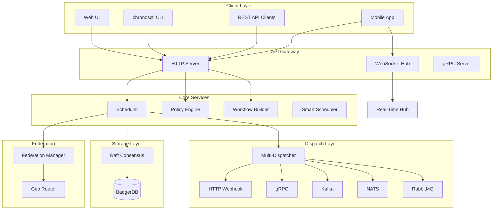

## Core Components

### Scheduler

The scheduler is responsible for:
- Parsing cron expressions and calculating next run times
- Triggering job executions at the appropriate time
- Managing job state (enabled/disabled, running, etc.)
- Enforcing concurrency policies (allow, forbid, replace)

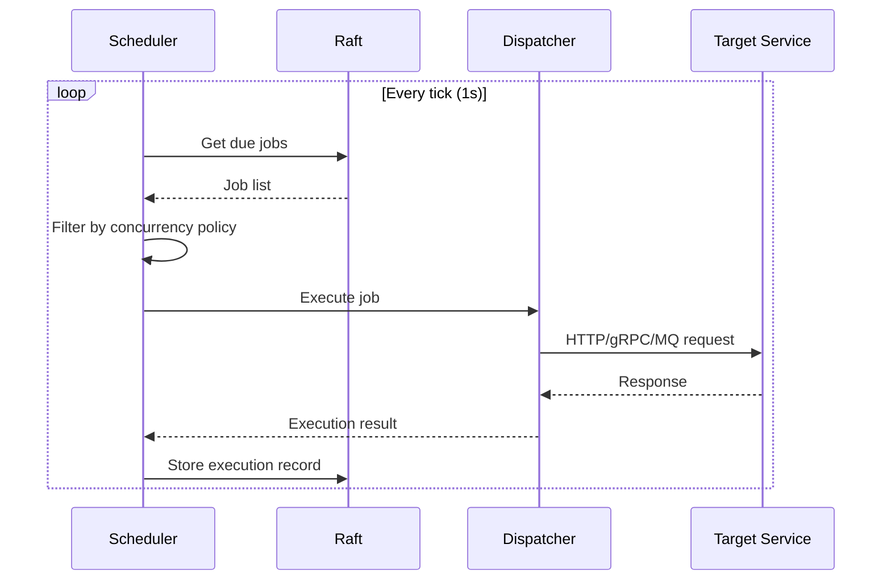

### Raft Consensus

Chronos uses HashiCorp Raft for distributed consensus:
- Leader election ensures only one node schedules jobs
- Log replication keeps all nodes in sync
- Snapshot and restore for state recovery

### Storage (BadgerDB)

All state is persisted in BadgerDB:
- Jobs and their configurations
- Execution history
- Cluster membership
- User sessions and API keys

## Next-Gen Feature Architecture

### Multi-Protocol Dispatch

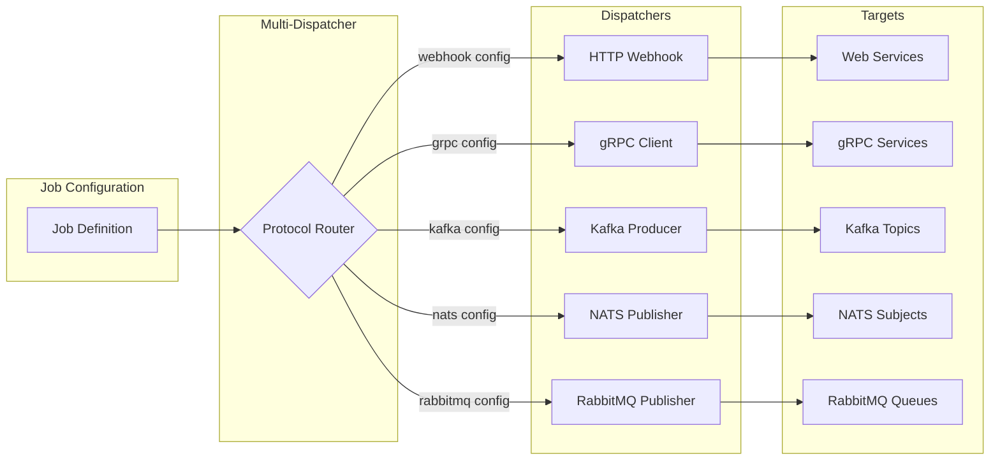

### Visual Workflow Builder (DAG)

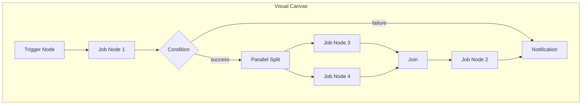

**Node Types:**
| Type | Description |
|------|-------------|
| `trigger` | Entry point (cron, webhook, manual) |
| `job` | Execute a Chronos job |
| `condition` | Branch based on expression |
| `parallel` | Split into concurrent branches |
| `join` | Wait for parallel branches |
| `delay` | Wait for duration |
| `approval` | Pause for human approval |
| `notification` | Send alert (Slack, email, etc.) |
| `script` | Execute inline script |
| `http` | Make HTTP request |
| `transform` | Transform data |
| `subworkflow` | Execute nested workflow |

### Policy-as-Code Engine

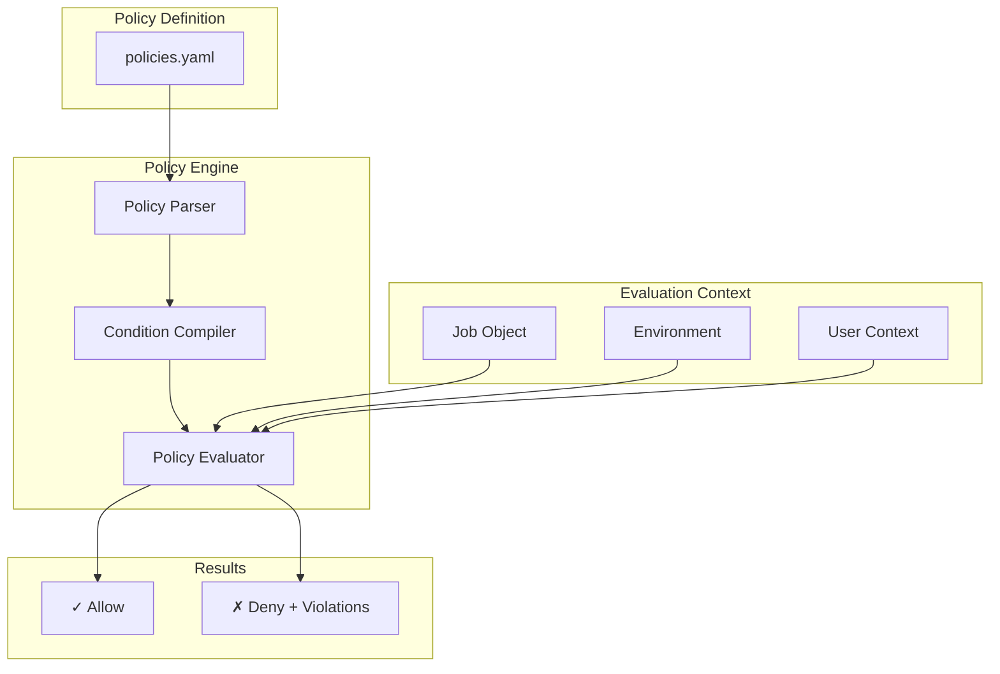

**Example Policy:**
```yaml
name: production-security
description: Security rules for production jobs
rules:
  - name: https-only
    condition:
      field: webhook.url
      operator: starts_with
      value: "https://"
    action: deny
    message: "Production jobs must use HTTPS"
    
  - name: naming-convention
    condition:
      field: name
      operator: regex_matches
      value: "^[a-z][a-z0-9-]*$"
    action: deny
    message: "Job names must be lowercase with hyphens"
```

### Cross-Region Federation

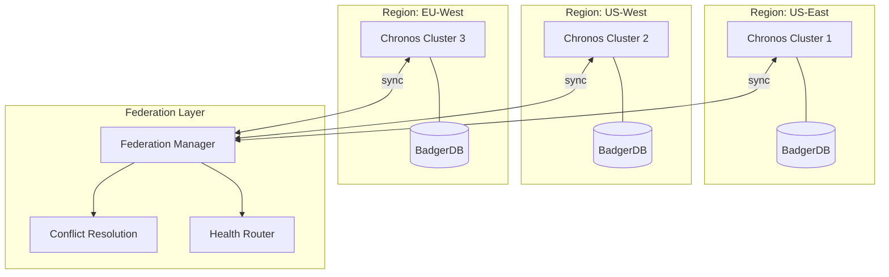

**Conflict Resolution Strategies:**
- `newest` - Most recent modification wins
- `owner_wins` - Originating cluster wins
- `merge` - Combine non-conflicting changes

### AI-Powered Schedule Optimization

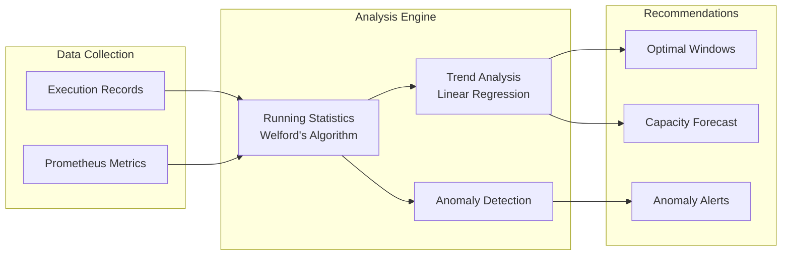

### Real-Time Collaboration

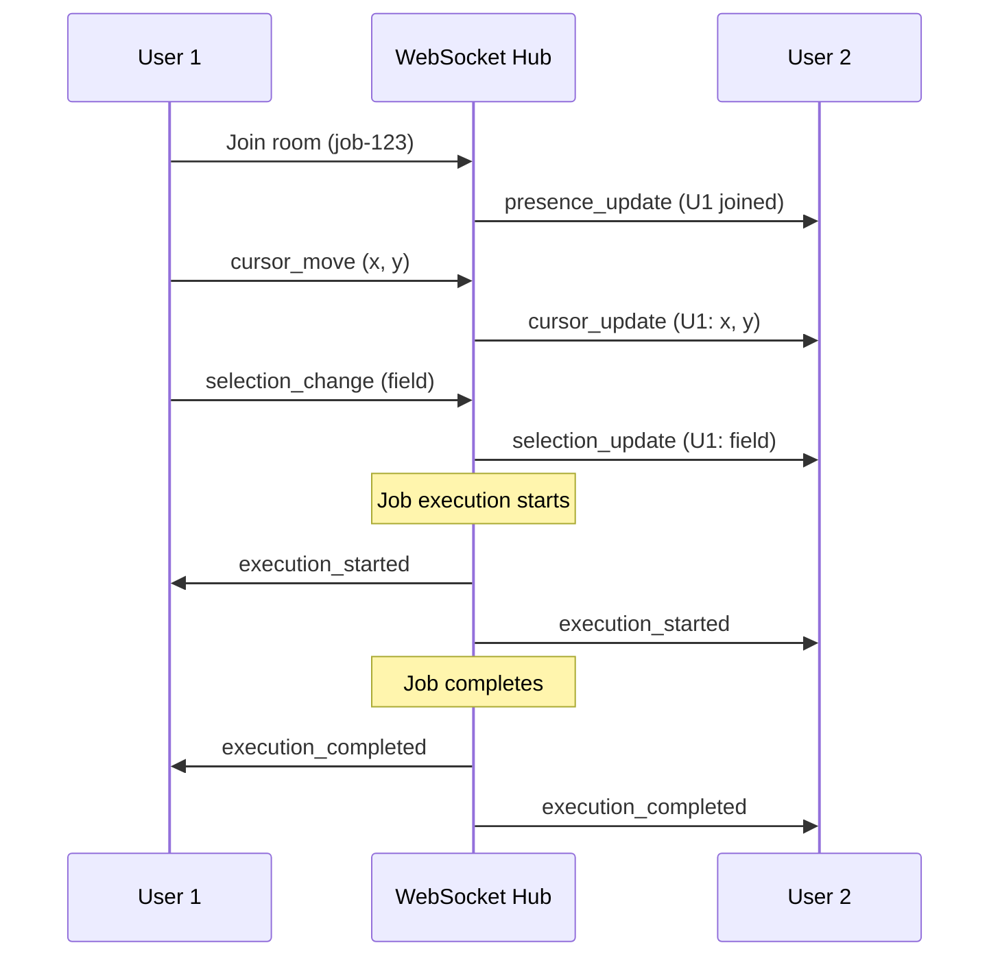

### Time-Travel Debugging

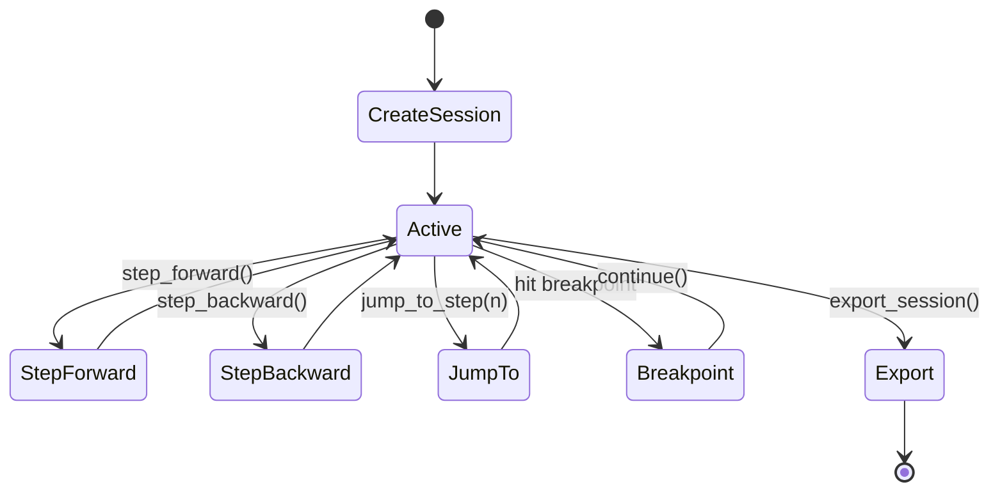

**Breakpoint Types:**
- `step` - Break at specific step number
- `type` - Break on node type (e.g., all HTTP nodes)
- `condition` - Break when expression is true
- `error` - Break on any error

### Cloud Control Plane

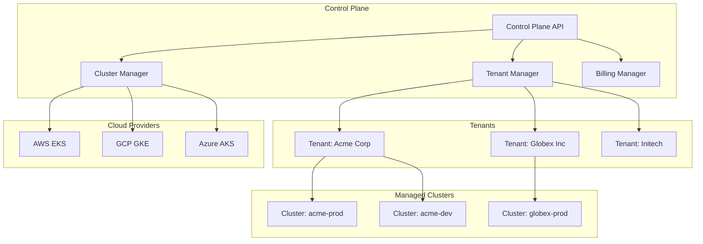

**Subscription Plans:**
| Plan | Jobs | Executions/mo | Retention | Features |
|------|------|---------------|-----------|----------|
| Free | 10 | 1,000 | 1 day | Basic |
| Starter | 100 | 50,000 | 7 days | + Webhooks |
| Pro | 1,000 | 500,000 | 30 days | + Federation |
| Enterprise | Unlimited | Unlimited | 90 days | + SSO, SLA |

## Data Flow

### Job Execution Flow

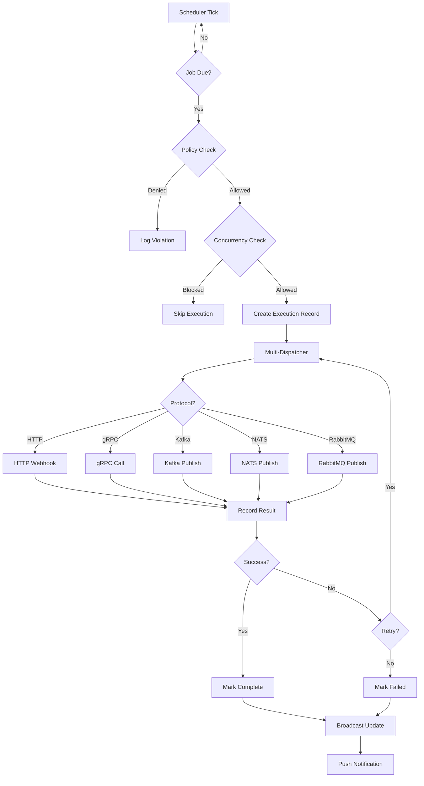

## Package Structure

```
chronos/
├── cmd/
│   ├── chronos/          # Main server binary
│   └── chronosctl/       # CLI tool
├── internal/
│   ├── analytics/        # Execution analytics and reporting
│   ├── api/              # HTTP handlers
│   ├── assistant/        # AI-powered job creation
│   ├── autoscale/        # Predictive cluster autoscaling
│   ├── chaos/            # Chaos engineering framework
│   ├── cloudevents/      # CloudEvents protocol support
│   ├── compliance/       # Compliance and audit framework
│   ├── config/           # Configuration management
│   ├── cost/             # Multi-cloud cost optimization
│   ├── dag/              # DAG engine + workflow builder
│   ├── dispatcher/       # Multi-protocol dispatchers
│   ├── eventmesh/        # Event mesh integration
│   ├── events/           # Event-driven triggers
│   ├── geo/              # Federation + geo routing
│   ├── gitops/           # Git-based job synchronization
│   ├── marketplace/      # Job templates
│   ├── metrics/          # Prometheus metrics
│   ├── mobile/           # Push notifications
│   ├── models/           # Domain models
│   ├── notify/           # Notification system
│   ├── policy/           # Policy-as-code engine
│   ├── prediction/       # ML-based failure prediction
│   ├── raft/             # Raft consensus
│   ├── rbac/             # Role-based access control
│   ├── realtime/         # WebSocket collaboration
│   ├── replay/           # Time-travel debugging
│   ├── sandbox/          # Isolated container execution
│   ├── scheduler/        # Core scheduler
│   ├── search/           # Semantic job search
│   ├── secrets/          # Secret injection (Vault, cloud)
│   ├── smartsched/       # AI optimization
│   ├── storage/          # BadgerDB wrapper
│   ├── studio/           # Webhook testing
│   ├── tenant/           # Multi-tenant support
│   ├── tracing/          # OpenTelemetry integration
│   └── wasm/             # WebAssembly plugin runtime
├── pkg/
│   ├── clock/            # Time utilities
│   ├── cloud/            # Cloud control plane
│   ├── cron/             # Cron parser
│   ├── duration/         # Duration parsing
│   ├── executor/         # Cloud function executors
│   ├── grpc/             # gRPC service definitions
│   └── plugin/           # Plugin interfaces
└── web/                  # React UI
```

## Security Considerations

1. **Authentication**: API keys, JWT tokens, OAuth2
2. **Authorization**: Role-based access control (RBAC)
3. **Encryption**: TLS for all network communication
4. **Secrets**: Webhook credentials stored encrypted with Vault/cloud integration
5. **Audit**: All actions logged with user context
6. **Policy Enforcement**: Pre-execution policy checks
7. **Compliance**: SOC2, HIPAA, GDPR policy support
8. **Sandbox Execution**: Isolated container environments for untrusted jobs

## Performance Characteristics

| Metric | Target |
|--------|--------|
| Scheduling latency | < 100ms |
| Job throughput | 10,000 jobs/sec |
| Cluster failover | < 5 seconds |
| API response time | < 50ms (p99) |
| WebSocket broadcast | < 10ms |
